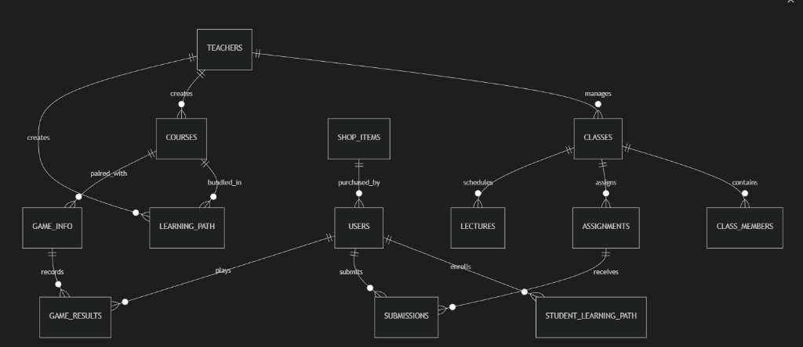

# E-V-E — Educational Virtual Ecosystem

Nền tảng học tập trực tuyến thông minh tích hợp trợ lý AI gia sư sư phạm và hệ thống minigame giáo dục Gamification qua SDK mở.  
Dự án đồ án / nghiên cứu phát triển thuộc lớp **TTCM - RnD - K18**.

---

## 🌐 Trải Nghiệm Trực Tuyến & Tài Liệu Báo Cáo

- **Website Trải Nghiệm Demo:** [https://ttcm-rnd-k18.vercel.app](https://ttcm-rnd-k18.vercel.app)
- **Thư mục tài liệu (Google Drive):** [Drive Folder](https://drive.google.com/drive/folders/1clPPIeyvm3CkhCIhyYJAkFBPT7n_2v02)
- **Kế hoạch & tiến độ (Google Sheets):** [Sheets Báo Cáo](https://docs.google.com/spreadsheets/d/1XVPI0MKJFvKDSKv91b8vD7zJRsw2_1AHGjsWmiVpclA/edit?usp=sharing)

### 🔑 Danh Sách Tài Khoản Thử Nghiệm Mặc Định

| Vai trò | Email | Mật khẩu | Chức năng chính |
|:---|:---|:---:|:---|
| **Học sinh (Student)** | `dat@gmail.com` | `123456` | Xem lộ trình, mở khóa chặng tuần tự, hỏi AI Tutor, chơi Memory Match nạp Extra Data, đổi quà cửa hàng |
| **Giảng viên (Teacher)** | `dat1@gmail.com` | `123456` | Quản lý lớp học, tạo & chấm bài tập, tải lên bài giảng, kiểm duyệt minigame |
| **Quản trị viên (Admin)** | `dat2@gmail.com` | `123456` | Quản lý người dùng, duyệt game engine và lộ trình học tập toàn hệ thống |

> **Ghi chú:** Dự án được thiết lập chế độ bảo mật xác thực OTP 2FA mặc định qua Firebase Authentication.

---

## 👥 Thành Viên Nhóm Phát Triển

| STT | Họ và Tên | Vai trò | Phụ trách chính |
|:---:|:---|:---:|:---|
| 1 | **Nguyễn Nhật Anh** | Trưởng nhóm | System Architecture, Backend API, Game SDK, AI Tutor & Gemini Integration, Security & 2FA |
| 2 | **Nguyễn Thành Đạt** | Thành viên | Giao diện Class & Sequential Learning Path Map, Memory Matching Game Engine, Dashboard |
| 3 | **Đàm Tuấn Nhiên** | Thành viên | Giao diện Landing Page, quản lý tài nguyên số, tổng hợp tài liệu báo cáo & Demo |

---

## 🚀 Các Tính Năng Nổi Bật

### 1. 🗺️ Bản Đồ Cây Kỹ Năng & Mở Khóa Tuần Tự (Sequential Learning Path)
- **Học tập có định hướng**: Các chặng bài học được kết nối theo dạng đồ thị cây kỹ năng trực quan.
- **Cơ chế mở khóa tuần tự**: Học sinh bắt buộc phải hoàn thành đủ số lượt chơi minigame thực hành ở chặng trước để mở khóa chặng tiếp theo.
- **Kiểm soát trạng thái lớp học**: Nếu học sinh đang ở trạng thái **Tạm Dừng (Bảo Lưu)** hoặc **Chưa Đăng Ký**, toàn bộ chặng bài học và game thực hành sẽ tự động bị khóa với cảnh báo hướng dẫn chi tiết.

### 2. 🎮 E-V-E Game SDK & Minigame Ghép Cặp Thẻ Bài (Memory Match)
- **Tự động Preload Extra Data**: Khi bắt đầu một bài học, minigame tự động kết nối máy chủ, xác thực Game Session Token và tải bộ câu hỏi / khái niệm định nghĩa của bài học.
- **Preloader mượt mà**: Thanh tiến độ nạp dữ liệu hiển thị trực tiếp bên trong khung chứa trò chơi (Game Container).
- **Cơ chế Chống Gian Lận (Anti-Cheat)**: Ký mã token phiên chơi từ máy chủ, kiểm soát thời gian chơi tối thiểu và hạn mức điểm tối đa hợp lệ.

### 3. 🤖 Ứng Dụng Trí Tuệ Nhân Tạo (Google Gemini AI)
- **AI Tutor cho Học Sinh**: Giải đáp thắc mắc lập trình 24/7, hướng dẫn tư duy giải bài tập, định dạng code syntax highlight với nút sao chép nhanh.
- **AI Assistant cho Giáo Viên**: Hỗ trợ tự động tạo ngân hàng câu hỏi, soạn khung giáo án và cấu trúc nội dung bài giảng.
- **Bảo Mật Client-Side**: Khóa Gemini API Key cá nhân được mã hóa và lưu trữ độc quyền tại trình duyệt (Local Storage), không lưu trữ trên máy chủ backend.

### 4. 🏫 Quản Lý Lớp Học & Tương Tác Sư Phạm (Class Hub)
- **Theo dõi tiến độ học tập**: Đo lường phần trăm hoàn thành chặng học, điểm danh, bảng xếp hạng lớp học.
- **Giao bài & Chấm bài**: Học sinh nộp bài trực tuyến, giáo viên chấm điểm và nhận xét chi tiết.
- **Cửa Hàng Đổi Quà Gamification**: Tích lũy E-V-E Coins qua việc hoàn thành bài học và minigame để đổi các vật phẩm độc quyền.

---

## 🛠️ Công Nghệ Sử Dụng (Tech Stack)

- **Frontend:** Next.js 16 (App Router & Turbopack), React 19, TypeScript, Tailwind CSS, Lucide Icons, Framer Motion
- **Backend & API:** Next.js Route Handlers, Clean Architecture (Entities, Ports, Adapters)
- **Cơ Sở Dữ Liệu & Auth:** Firebase Cloud Firestore, Firebase Authentication (2FA OTP), Firebase Admin SDK
- **Trí Tuệ Nhân Tạo:** Google Generative AI (Gemini 1.5 Pro / Flash)
- **Game Engine & SDK:** HTML5 Canvas, Web Audio API, E-V-E Game Bridge Protocol

---

## 💻 Hướng Dẫn Cài Đặt & Chạy Môi Trường Cục Bộ (Local Setup)

### Yêu Cầu Môi Trường
- **Node.js**: Phiên bản 18.x hoặc 20.x trở lên
- **Trình quản lý gói**: `npm` (hoặc `yarn` / `pnpm`)
- Dự án Firebase đã kích hoạt Authentication và Cloud Firestore

### 1. Clone Source Code
```bash
git clone https://github.com/SPdream99/ttcm-rnd-k18.git
cd ttcm-rnd-k18/e-v-e
```

### 2. Cài Đặt Thư Viện Phụ Thuộc
```bash
npm install
```

### 3. Cấu Hình Biến Môi Trường
Tạo file `.env.local` trong thư mục `e-v-e/` (tham khảo mẫu `.env.local.example`):

```env
# Firebase Client SDK
NEXT_PUBLIC_FIREBASE_API_KEY="your-api-key"
NEXT_PUBLIC_FIREBASE_AUTH_DOMAIN="your-project.firebaseapp.com"
NEXT_PUBLIC_FIREBASE_PROJECT_ID="your-project-id"
NEXT_PUBLIC_FIREBASE_STORAGE_BUCKET="your-project.appspot.com"
NEXT_PUBLIC_FIREBASE_MESSAGING_SENDER_ID="your-sender-id"
NEXT_PUBLIC_FIREBASE_APP_ID="your-app-id"

# Firebase Admin SDK (JSON string hoặc credentials)
FIREBASE_ADMIN_SERVICE_ACCOUNT_KEY='{"type":"service_account",...}'

# Gemini AI API Key
GEMINI_API_KEY="your-gemini-api-key"

# Mặc định sử dụng Firebase Firestore
USE_MOCK_DB="false"
```

### 4. Khởi Tạo Cơ Sở Dữ Liệu Chuẩn (Seed Firestore)
Chạy script chuẩn hóa dữ liệu 100% Tiếng Việt có dấu:
```bash
node scripts/reset_firestore.js
```

### 5. Khởi Chạy Server Phát Triển
```bash
npm run dev
```
Mở trình duyệt và truy cập: `http://localhost:3000`

---

## 📁 Cấu Trúc Thư Mục Dự Án (`e-v-e/`)

```text
e-v-e/
├── app/                  # Next.js App Router (Giao diện & API Routes)
│   ├── (auth)/           # Đăng nhập, đăng ký, xác thực 2FA
│   ├── admin/            # Trang quản trị dành cho Admin
│   ├── api/              # API endpoints (AI Tutor, Game SDK Init & Verify, Class...)
│   ├── student/          # Dashboard, bản đồ chặng, lớp học, phòng chơi game của học sinh
│   └── teacher/          # Quản lý lớp, sổ điểm, tạo bài tập dành cho giảng viên
├── components/           # UI Components dùng chung (LearningPathMap, Sidebar, Navbar...)
├── core/                 # Clean Architecture (Entities, Ports, Use Cases)
├── infrastructure/       # Database Adapters (Firestore & Repositories)
├── lib/                  # Tiện ích, Firebase Client/Admin, Anti-Cheat Helpers
├── public/               # Tài nguyên tĩnh, âm thanh, icons
└── scripts/              # Script quản trị & Reset cơ sở dữ liệu (reset_firestore.js)
```

---

## 📊 Sơ Đồ Cơ Sở Dữ Liệu (Firestore ERD Schema)



---

## 📜 Bản Quyền & Giấy Phép

Dự án được nghiên cứu và phát triển bởi **Nhóm 1 — Lớp TTCM - RnD - K18 (MindX)**.  
Dành cho mục đích học tập, nghiên cứu khoa học và báo cáo đồ án.
